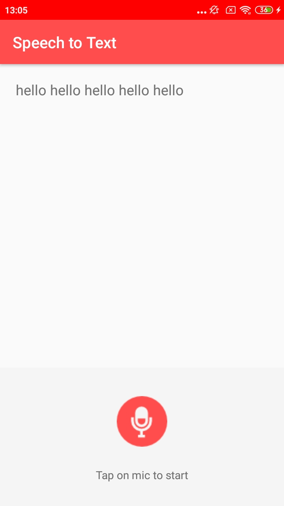

# SpeechToText
Learn how to convert Speech to Text or Voice to Text in Android. 

As soon as a user say something, Android will recognize his/her voice and convert it into text.

    - It will do it through RecognizerIntent.
    - You do not require any internet connection to use the voice to text service. 
    - It will work in Offline mode.

### Screenshot

